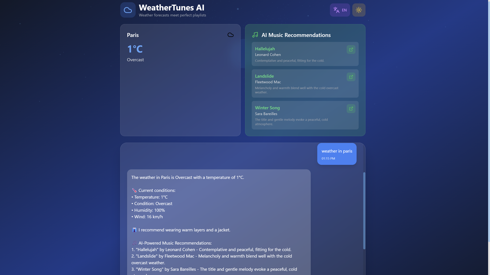

# 🌤️ WeatherTunes AI - Weather-Based Music Recommendation Chatbot

<div align="center">


**An intelligent chatbot that combines real-time weather data with AI-powered music recommendations using Google's Gemini AI and Spotify API.**



[Features](#-features) • [Demo](#-demo) • [Installation](#-installation) • [API Keys](#-api-keys-setup) • [Usage](#-usage) • [Architecture](#-architecture)

</div>

---

## 📋 Table of Contents

- [Overview](#-overview)
- [Tech Stack](#-tech-stack)
- [Architecture](#-architecture)
- [Prerequisites](#-prerequisites)
- [Installation](#-installation)
- [Environment Variables](#-environment-variables)
- [Project Structure](#-project-structure)
- [How It Works](#-how-it-works)


---

## 🌟 Overview

**WeatherTunes AI** is a full-stack web application that revolutionizes how users discover music based on weather conditions. By combining real-time weather data from WeatherAPI.com, Google's Gemini AI for intelligent music curation, and Spotify's vast music library, the app creates a personalized and contextual music experience.

### What Makes It Special?

- 🤖 **AI-Powered Recommendations**: Uses Google Gemini 2.0 Flash to intelligently select songs that match weather moods
- 🎵 **Spotify Integration**: Direct links to songs on Spotify with album art and previews
- 🌍 **Global Weather Data**: Real-time weather information for any city worldwide
- 💬 **Conversational AI**: Natural language processing for casual conversations
- 🌐 **Multilingual Support**: Full English and Japanese language support
- 🎨 **Beautiful UI**: Modern, responsive design with dark/light mode and 3D animations
- ⚡ **Real-Time Updates**: Instant weather and music recommendations

---


## 🛠 Tech Stack

### Frontend
- **React 18.3.1** - UI framework
- **Vite 5.4.21** - Build tool and dev server
- **Tailwind CSS 3.4.18** - Utility-first CSS framework
- **Three.js 0.163.0** - 3D graphics and animations
- **Lucide React** - Beautiful icon library
- **Axios** - HTTP client for API calls

### Backend
- **Node.js** - JavaScript runtime
- **Express 4.21.2** - Web application framework
- **Google Generative AI 0.24.1** - Gemini AI integration
- **Spotify Web API Node 5.0.2** - Spotify API wrapper
- **Axios** - HTTP client
- **CORS** - Cross-Origin Resource Sharing
- **dotenv** - Environment variable management

### APIs
- **Google Gemini AI** - AI-powered music curation
- **Spotify Web API** - Music data and playback links
- **WeatherAPI.com** - Real-time weather data

---

## 🏗 Architecture

```
┌─────────────────┐
│   Frontend      │
│   (React + UI)  │
└────────┬────────┘
         │
         │ HTTP/HTTPS
         │
┌────────▼────────┐
│   Backend       │
│   (Express)     │
└────────┬────────┘
         │
    ┌────┴────┬─────────┬──────────┐
    │         │         │          │
┌───▼───┐ ┌──▼──┐ ┌────▼────┐ ┌───▼───┐
│Gemini │ │Spot │ │Weather  │ │ Chat  │
│  AI   │ │ ify │ │   API   │ │ Logic │
└───────┘ └─────┘ └─────────┘ └───────┘
```

### Request Flow

1. **User Input** → Frontend (React)
2. **API Request** → Backend (Express)
3. **Weather Data** → WeatherAPI.com
4. **AI Processing** → Google Gemini AI (song recommendations)
5. **Spotify Search** → Spotify API (track links and metadata)
6. **Response** → Backend formats and sends to Frontend
7. **Display** → React renders weather + music cards

---

## 📦 Prerequisites

Before installing, ensure you have:

- **Node.js** (v18.0.0 or higher)
- **npm** (v9.0.0 or higher) or **yarn**
- **Git** (for cloning the repository)
- API keys for:
  - Google Gemini AI
  - Spotify Web API
  - WeatherAPI.com

---

## 🚀 Installation

### 1. Clone the Repository

```bash
git clone https://github.com/yourusername/weathertunes-ai.git
cd weathertunes-ai
```

### 2. Install Dependencies

```bash
# Install all dependencies (frontend + backend)
npm install
```

### 3. Set Up Environment Variables

Create a `.env` file in the **root directory**:

```bash
touch .env
```

Add your API keys (see [API Keys Setup](#-api-keys-setup) section):

```env
# Google Gemini AI
GEMINI_API_KEY=your_gemini_api_key_here

# Spotify API
SPOTIFY_CLIENT_ID=your_spotify_client_id
SPOTIFY_CLIENT_SECRET=your_spotify_client_secret

# Weather API
WEATHERAPI_KEY=your_weatherapi_key_here

# Server Port (optional)
PORT=3001
```

---


### Key Files Explained

#### `backend/server.js`
- Express API server
- Handles weather, music, and chat endpoints
- Manages Spotify token refresh
- Integrates Gemini AI for song recommendations
- Bulletproof JSON parsing for AI responses

#### `src/App.jsx`
- Main React component
- UI/UX logic and state management
- Three.js animated background
- Handles user input and API calls
- Multilingual support (EN/JP)

#### `src/main.jsx`
- React DOM rendering entry point

#### `src/index.css`
- Global styles and Tailwind directives
- Custom scrollbar styles
- Animation keyframes

---

## 🔧 How It Works

### 1. Weather Query Flow

```
User Types: "What's the weather in Paris?"
      ↓
Frontend extracts city name
      ↓
POST /api/weather { city: "Paris" }
      ↓
Backend calls WeatherAPI.com
      ↓
Returns: temp, condition, humidity, wind
      ↓
Frontend displays weather card
```

### 2. Music Recommendation Flow

```
Weather data received
      ↓
POST /api/music { condition, city, temp }
      ↓
Backend sends context to Gemini AI
      ↓
Gemini returns 5 song suggestions (JSON)
      ↓
Backend searches each song on Spotify (3 strategies)
      ↓
Returns songs with: name, artist, album, image, Spotify link
      ↓
Frontend displays music cards with play buttons
```

### 3. Gemini AI Prompt Strategy

The backend sends a carefully crafted prompt to Gemini:

```javascript
`You are an expert music curator. Based on the weather conditions below, 
suggest EXACTLY 5 popular songs that perfectly match the mood.

Weather Information:
- City: Tokyo
- Temperature: 25°C
- Condition: Sunny

Instructions:
1. Choose WELL-KNOWN songs from FAMOUS artists (must exist on Spotify)
2. Match the mood based on weather:
   - Sunny/Clear: Upbeat, happy, energetic songs
   - Rainy: Melancholic, cozy, reflective songs
   ...
3. Use EXACT song titles and artist names as they appear on Spotify

Return ONLY valid JSON array with EXACTLY 5 songs.`
```

### 4. Spotify Search Strategies

To ensure high-quality matches, the backend uses 3 search strategies:

**Strategy 1: Precise Search**
```javascript
track:"Here Comes the Sun" artist:"The Beatles"
```

**Strategy 2: Broader Search**
```javascript
Here Comes the Sun The Beatles
// Matches partial artist names
```

**Strategy 3: Name-Only Fallback**
```javascript
Here Comes the Sun
// Takes best match
```

### 5. Fallback System

If Gemini AI or Spotify fail, the app has weather-appropriate fallback songs:
- **Rainy:** "Purple Rain", "November Rain", etc.
- **Sunny:** "Here Comes the Sun", "Walking on Sunshine", etc.
- **Cloudy:** "Both Sides Now", "A Sky Full of Stars", etc.
- **Snowy:** "Let It Snow", "Winter Wonderland", etc.

---

## 🎨 Features in Detail

### Dark/Light Mode

Toggle between themes with smooth transitions:
- **Dark Mode:** Blue gradient background, white text
- **Light Mode:** Light blue gradient, dark text
- Persistent across sessions (localStorage)

### Multilingual Support

Full English and Japanese translations:
- All UI text translated
- Weather conditions translated
- Conversation responses translated
- Voice input supports both languages

### Voice Input

Powered by Web Speech API:
- Click microphone icon to start
- Speaks your query aloud
- Automatically fills input field
- Supports EN/JP recognition

### 3D Animated Background

Three.js particle system:
- 1000 animated particles
- Rotating sphere with emissive glow
- Dynamic lighting effects
- Theme-aware colors

### Responsive Design

Mobile-first approach:
- Works on phones, tablets, desktops
- Touch-optimized controls
- Adaptive layouts
- Smooth scrolling

---


## 🚀 Deployment

### Deploy to Render (Backend)

1. **Create Render Account:** [render.com](https://render.com)

2. **Create Web Service:**
   - Connect GitHub repo
   - Build Command: `npm install`
   - Start Command: `node backend/server.js`

3. **Add Environment Variables:**
   - Go to Environment tab
   - Add all keys from `.env`

4. **Deploy:** Render will auto-deploy

5. **Get Backend URL:** `https://your-app.onrender.com`

### Deploy to Vercel (Frontend)

1. **Create Vercel Account:** [vercel.com](https://vercel.com)

2. **Import Project:**
   - Connect GitHub repo
   - Framework: Vite
   - Build Command: `npm run build`
   - Output Directory: `dist`

3. **Add Environment Variable:**
   ```
   VITE_API_URL=https://your-render-backend.onrender.com
   ```

4. **Deploy:** Auto-deploys on push

### Update Frontend API URL

```javascript
// In src/App.jsx
const API_BASE_URL = import.meta.env.VITE_API_URL || 'http://localhost:3001';
```

---


## 🔮 Future Roadmap

- [ ] User accounts and saved preferences
- [ ] Playlist creation and export to Spotify
- [ ] Historical weather trends


</div>
